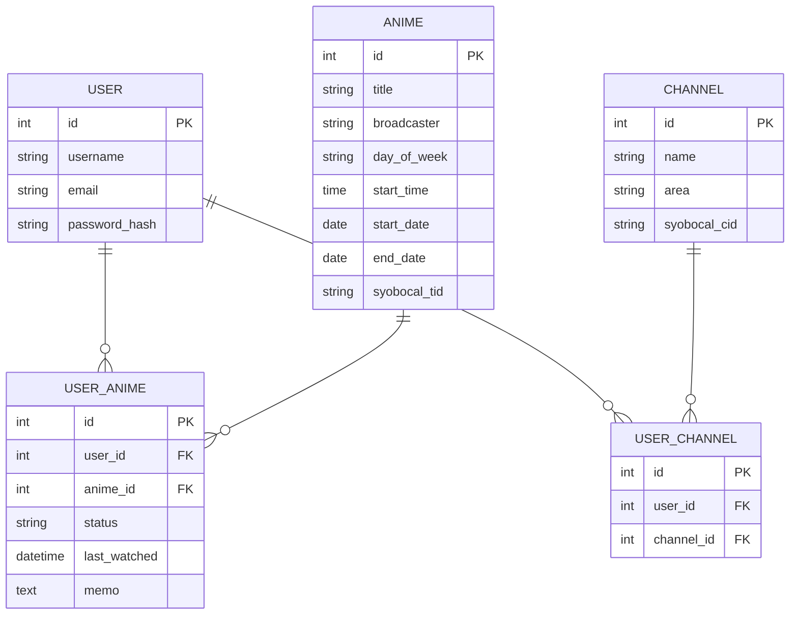

# データモデル・ER図

## 概要
本アプリで管理する主なデータ構造と、各テーブルの関係を示す。

---

## ER図

---

## テーブル定義（例）

### USER
| カラム名        | 型         | 説明           |
|----------------|------------|----------------|
| id             | int        | 主キー         |
| username       | string     | ユーザー名     |
| email          | string     | メールアドレス |
| password_hash  | string     | パスワードハッシュ |

### ANIME
| カラム名        | 型         | 説明           |
|----------------|------------|----------------|
| id             | int        | 主キー         |
| title          | string     | アニメタイトル |
| broadcaster    | string     | 放送局         |
| day_of_week    | string     | 放映曜日       |
| start_time     | time       | 放映開始時刻   |
| start_date     | date       | 放送開始日     |
| end_date       | date       | 放送終了日     |
| syobocal_tid   | string     | しょぼいカレンダーAPIの番組ID |

### USER_ANIME
| カラム名        | 型         | 説明           |
|----------------|------------|----------------|
| id             | int        | 主キー         |
| user_id        | int        | ユーザーID     |
| anime_id       | int        | アニメID       |
| status         | string     | 視聴状態（"watching", "watched", "plan_to_watch"）|
| last_watched   | datetime   | 最終視聴日時   |
| memo           | text       | メモ           |

### CHANNEL
| カラム名        | 型         | 説明           |
|----------------|------------|----------------|
| id             | int        | 主キー         |
| name           | string     | 放送局名       |
| area           | string     | 地域           |
| syobocal_cid   | string     | しょぼいカレンダーAPIの局ID |

### USER_CHANNEL
| カラム名        | 型         | 説明           |
|----------------|------------|----------------|
| id             | int        | 主キー         |
| user_id        | int        | ユーザーID     |
| channel_id     | int        | 放送局ID       |

---

## 備考
- ANIMEテーブルはしょぼいカレンダーAPIのデータをもとに自動更新
- USER_ANIMEテーブルでユーザーごとの視聴状態・メモ等を管理
- USER_CHANNELテーブルでユーザーごとの視聴可能な放送局を管理
- 必要に応じて拡張可能（タグ、通知設定など）
