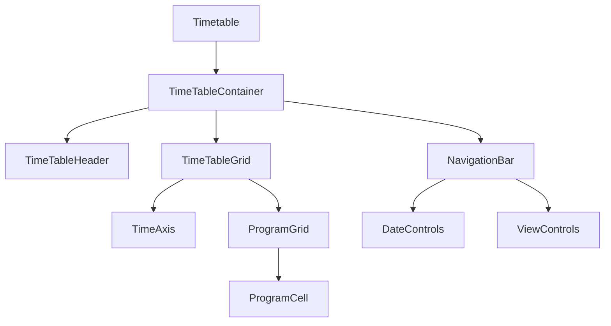

# モダンなタイムテーブルUI実装計画 v2

## 1. デザインシステム

### Material Design v3ベース
- カラーパレット: Material You のダイナミックカラー
- エレベーション: カード、シャドウの活用
- モーション: 自然な遷移アニメーション

```css
/* カラーパレット例 */
:root {
  --md-sys-color-primary: #006495;
  --md-sys-color-surface: #fdfcff;
  --md-sys-color-surface-variant: #dce4e9;
  --md-elevation-1: 0px 1px 3px 1px rgba(0, 0, 0, 0.15);
}
```

## 2. コンポーネント構造



### モダンUIコンポーネント
- **NavigationBar**: フローティングツールバー
- **ProgramCell**: インタラクティブなカードデザイン
- **TimeAxis**: スティッキーヘッダー
- **ViewControls**: セグメントコントロール

## 3. インタラクション設計

### ジェスチャー操作
```typescript
// スワイプナビゲーション
const handleSwipe = (direction: 'left' | 'right') => {
  direction === 'left' ? navigateNext() : navigatePrev();
};

// ピンチズーム（表示期間変更）
const handlePinch = (scale: number) => {
  scale > 1 ? expandView() : contractView();
};
```

### アニメーション
- 日付切り替え: スライドトランジション
- プログラムセル: ホバー/タップ時のエレベーション変更
- 更新時: スケルトンローディング

## 4. レスポンシブ戦略

### アダプティブレイアウト
```css
/* モバイルファースト */
.timetable-grid {
  grid-template-columns: [time] 4rem repeat(var(--days), 1fr);
}

/* タブレット (768px+) */
@media (min-width: 768px) {
  .timetable-grid {
    grid-template-columns: [time] 6rem repeat(var(--days), 1fr);
  }
}

/* デスクトップ (1024px+) */
@media (min-width: 1024px) {
  .timetable-grid {
    grid-template-columns: [time] 8rem repeat(var(--days), 1fr);
  }
}
```

### コンテキストに応じた表示調整
- モバイル: 1日表示がデフォルト
- タブレット: 2日表示がデフォルト
- デスクトップ: 3日/週間表示がデフォルト

## 5. パフォーマンス最適化

### 仮想化実装
```typescript
import { FixedSizeGrid } from 'react-window';

const TimeTable: React.FC = () => {
  return (
    <FixedSizeGrid
      columnCount={daysToShow}
      rowCount={48} // 30分 × 24時間
      columnWidth={columnWidth}
      rowHeight={30}
      height={windowHeight}
      width={windowWidth}
    >
      {({ columnIndex, rowIndex, style }) => (
        <ProgramCell
          data={getProgramData(columnIndex, rowIndex)}
          style={style}
        />
      )}
    </FixedSizeGrid>
  );
};
```

### メモ化戦略
```typescript
// プログラムセルのメモ化
const ProgramCell = React.memo(({ program }: ProgramCellProps) => {
  // セルの実装
}, (prevProps, nextProps) => {
  return prevProps.program.id === nextProps.program.id &&
         prevProps.isWatching === nextProps.isWatching;
});
```

## 6. アクセシビリティ

### キーボードナビゲーション
```typescript
const handleKeyboard = (e: KeyboardEvent) => {
  switch (e.key) {
    case 'ArrowRight': navigateNext(); break;
    case 'ArrowLeft': navigatePrev(); break;
    case 'Home': navigateToday(); break;
  }
};
```

### ARIA実装
```typescript
<div
  role="grid"
  aria-label="番組表"
  aria-rowcount={48}
  aria-colcount={daysToShow}
>
  {/* グリッドの実装 */}
</div>
```

## 7. エラー処理・フォールバック

### エラーバウンダリ
```typescript
class TimeTableErrorBoundary extends React.Component {
  static getDerivedStateFromError(error) {
    return { hasError: true };
  }

  render() {
    if (this.state.hasError) {
      return <ErrorFallback onRetry={this.handleRetry} />;
    }
    return this.props.children;
  }
}
```

### スケルトンローディング
```typescript
const TimeTableSkeleton: React.FC = () => (
  <div className="timetable-skeleton">
    {Array.from({ length: 10 }).map((_, i) => (
      <div key={i} className="skeleton-row animate-pulse" />
    ))}
  </div>
);
```

## 8. 実装ステップ

1. **基盤構築** (Week 1)
   - デザインシステムのセットアップ
   - ベースコンポーネントの作成
   - グリッドレイアウトの実装

2. **コア機能実装** (Week 1-2)
   - プログラムセルの実装
   - ナビゲーション機能
   - データ取得・表示ロジック

3. **インタラクション実装** (Week 2)
   - ジェスチャー操作
   - アニメーション
   - エラー処理

4. **最適化** (Week 3)
   - パフォーマンス改善
   - レスポンシブ対応
   - アクセシビリティ対応

5. **テスト・改善** (Week 3-4)
   - ユニットテスト
   - E2Eテスト
   - パフォーマンステスト

## 9. 技術スタック

- **フレームワーク**: React 18 + TypeScript
- **スタイリング**: Tailwind CSS + CSS Modules
- **アニメーション**: Framer Motion
- **仮想化**: react-window
- **状態管理**: Zustand
- **テスト**: Jest + React Testing Library

---

このプランは最新のWeb技術とベストプラクティスを活用し、パフォーマンスとユーザー体験を重視したモダンなタイムテーブルUIの実装を目指します。