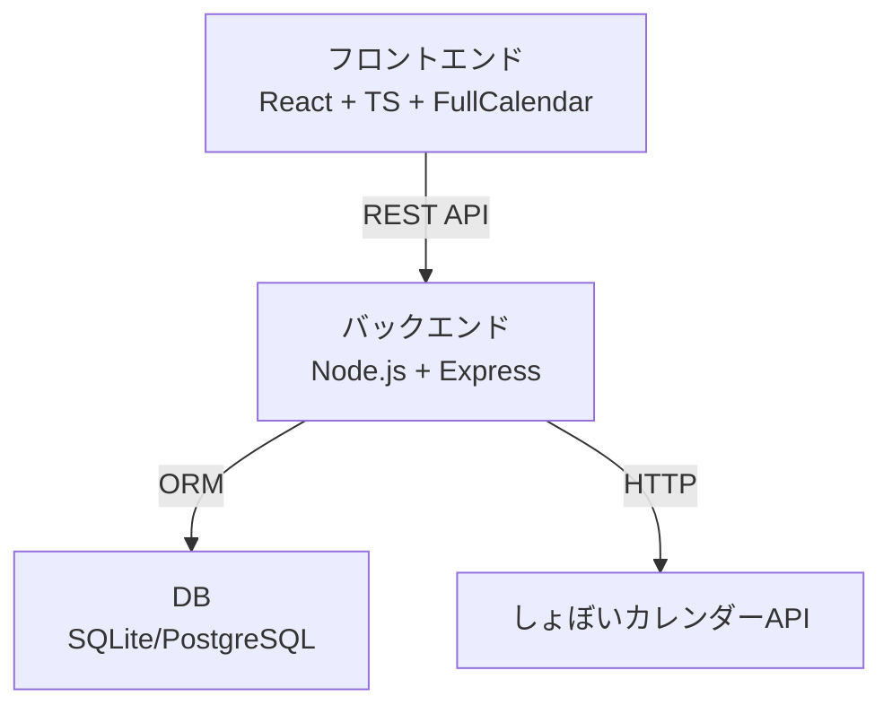

# システム構成・技術スタック

## 全体構成

本アプリは以下の構成で開発する。

```
[ユーザー]
   │
   ▼
[フロントエンド] ──API── [バックエンド] ──DB── [データベース]
                                   │
                                   └─ [しょぼいカレンダーAPI]
```

---

## 技術スタック

### フロントエンド
- React + TypeScript
- UIライブラリ: MUI（Material-UI）または Chakra UI
- カレンダーUI: FullCalendar
- 状態管理: React Context または Redux
- 認証: JWTトークンによるセッション管理
- レスポンシブデザイン対応

### バックエンド
- Node.js (Express)
- 認証: JWT
- API連携: axios などでしょぼいカレンダーAPIと通信
- 定期実行: node-cron で自動データ更新

### データベース
- SQLite（開発用）または PostgreSQL（本番用）
- ORM: Prisma または Sequelize

### 外部API
- しょぼいカレンダーAPI（https://cal.syoboi.jp/doc/）

---

## システム構成図



---

## 主な設計ポイント

- フロントエンドはSPA構成、API経由でデータ取得・更新
- バックエンドはRESTful APIを提供し、認証・データ管理・外部API連携を担当
- 定期的にしょぼいカレンダーAPIから番組データを取得し、DBを自動更新
- ユーザーごとに視聴リスト・視聴状態を管理
- セキュアな認証・認可設計
