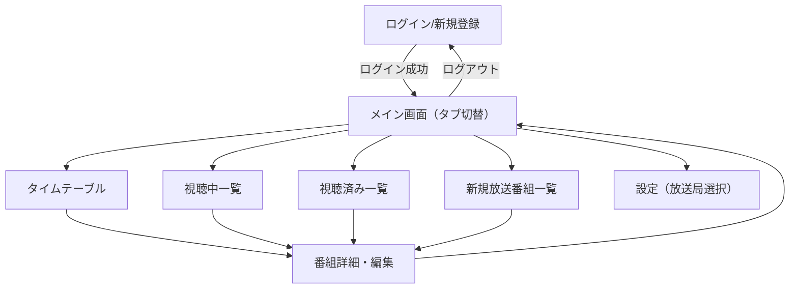

# 画面構成・画面遷移図・UIイメージ（修正版）

## 画面一覧・排他切り替え

- メイン画面は「タイムテーブル」「視聴中一覧」「視聴済み一覧」「新規放送番組一覧」を排他タブで切り替え
- タイムテーブル内に「視聴中のみ／全タイトル」切り替えUIを設置
- 設定画面（視聴可能な放送局の選択）を追加

---

## 画面遷移図



---

## 各画面のUIイメージ・主な要素

### メイン画面（タブ切替）
- タブ：「タイムテーブル」「視聴中一覧」「視聴済み一覧」「新規放送番組一覧」
- 各タブで該当画面を表示

### タイムテーブル画面
- グリッド形式の番組表（時間軸:縦、日付軸:横）
- 時間軸は30分単位、24時間表示
- デフォルトは2日表示、日付移動用のナビゲーションボタン（前の日/次の日、前週/次週）
- 番組セルの表示内容：
  - 開始時間、タイトル、放送局、話数、サブタイトル
  - 放送時間に応じて縦方向の高さを自動調整
  - 視聴中の番組は背景色で区別
  - 視聴する/しないのチェックボックス
- 「今すぐ更新」ボタン

### 視聴中一覧
- ユーザーが「視聴中」とマークした番組のリスト
- 番組タイトル、放送局、放送日時、ステータス表示
- 番組クリックで詳細・編集

### 視聴済み一覧
- 放送終了分も含めた「視聴済み」番組のリスト
- 検索・フィルタ機能

### 新規放送番組一覧
- しょぼいカレンダーAPIから取得した新規放送番組のみのリスト
- 「視聴中に追加」ボタン

### 番組詳細・編集ダイアログ
- 番組情報の表示・編集
- 視聴状態の切替、メモ追加

### 設定画面（放送局選択）
- しょぼいカレンダーAPIから取得した放送局一覧を表示
- ユーザーが自分の視聴可能な放送局を選択・保存
- 選択した放送局のみタイムテーブルや番組一覧に反映

--- 

## UIイメージ（ワイヤーフレーム例）

```
[メイン画面 - タイムテーブル]
+--------------------------------------------------+
| [タイムテーブル] [視聴中一覧] [視聴済み一覧] [新規放送] |
+--------------------------------------------------+
| [< 前の日][次の日 >][< 前週][次週 >] [今すぐ更新]    |
| 4/14(月)                 4/15(火)               |
|時刻  |             |     |             |       |
|00:00 |             |     |番組タイトル   |       |
|      |番組タイトル   |     |放送局名      |       |
|00:30 |放送局名      |     |#1 サブタイトル|       |
|      |#2 サブタイトル|     |[✓]          |       |
|01:00 |[✓]          |     |             |       |
|      |             |     |             |       |
+--------------------------------------------------+
| [視聴中一覧]／[視聴済み一覧]／[新規放送番組一覧]      |
| 番組リスト、詳細/編集ボタン                       |
+--------------------------------------------------+
```

---

## 備考
- すべての画面はPC/スマホ両対応のレスポンシブデザイン
- 検索・フィルタ・ソート機能は必要に応じて拡張
